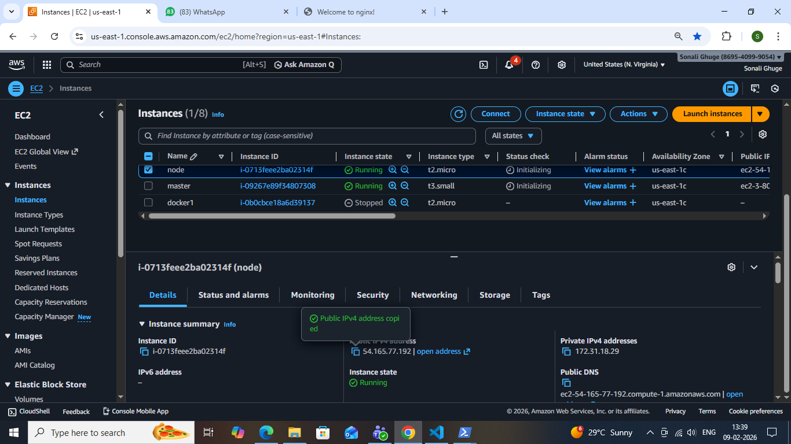
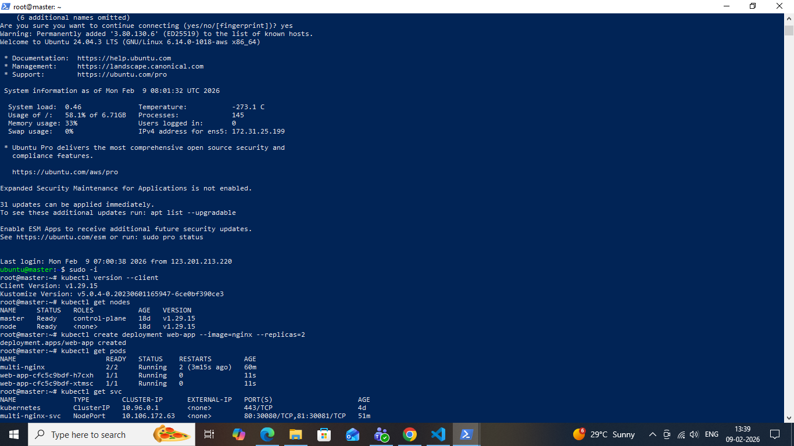
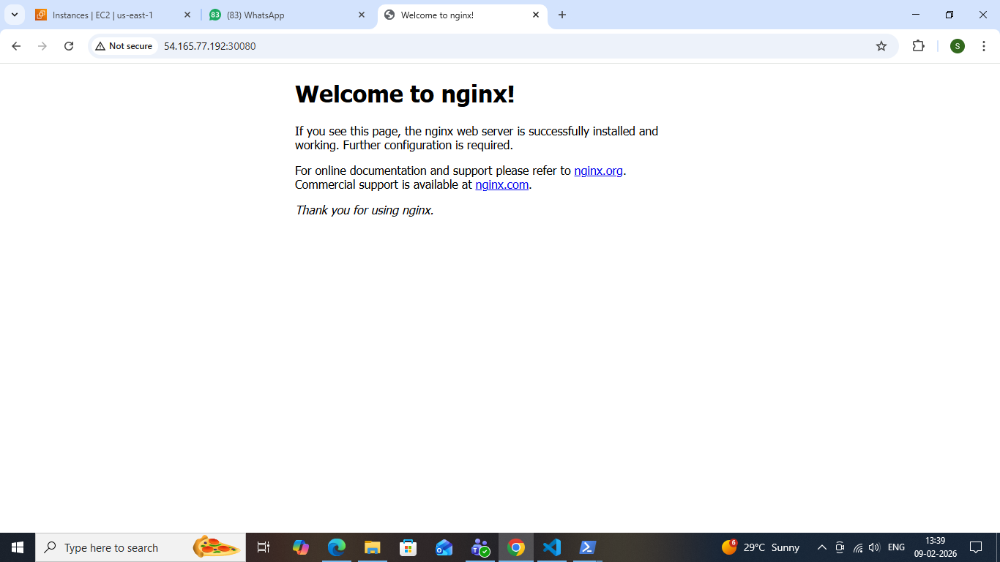

# K8s-Task
### MCQ
### Q1. What is the smallest unit that kubernetes deploy?
Ans: B. Pod

### Q2. Which  kubernetes object is used to expose pods to network traffice?
Ans: C. Service

### Q3. Which service type is used only for internal communication inside the cluster?
Ans: C. ClusterIP

### Q4. You want to access an application using <NodeIP>:<port>. Which service type should   you use?
Ans: B. NodePort

### Q5. Which service type is mainly used in cloud environments to expose application externally?
Ans: C. LoadBalancer

### Q6. A pod is deleted accidentally. which pod type can automatically recreate it?
Ans: C. Pod managed by Deployment

### Q7. Which pod type is used to run initialization tasks before the main container starts?
Ans: B. Init pod (init container)

### Q8. Containers inside the same pod communicate using:
Ans: C. Same IP address

### Q9. Which service assigns a stable internal IP address automatically?
Ans: c. ClusterIP

### Q10. You created a service . but traffic is not reaching the pod. what is the most common reason?
Ans: B. Label mismatch 

### Q11. Which kubernetes component provides DNS-based service discovery?
Ans: C. CoreDNS

### Q12. You want a pod to always run on a specific node. which pod type is used?
Ans: C. Static Pod

### Q13. Which service type exposes a fixed port on every node?
Ans: B. NodePort

### Q14. You want pods inside the cluster to access an application using a DNS name. which service type should you use?
Ans: C. ClusterIP

### Q15. Which command shows the IP address of a pod?
Ans: C. Kubectl logs pod 

### Q16. You created a loadbalancer service in a local cluster. what usually happens?
Ans: B. External IP stays pending

### Q17. Which pod type is commonly used to support a main application with logging or monitoring?
Ans: c. Sidecar pod

### Q18. Which service  field decides which pods receive traffic?
Ans: C. selector

### Q19. Which command is used to list all services in a namespace?
Ans: B.kubectl get svc 

### Q20. Two pods in the same namespace want to communicate. what is the recommended kubernetes way?
Ans: B. Use service name

### practical Task:

You are given an application image that runs a web server.
Perform the following steps:

1. Create a Deployment that runs the application with at least 2 pods.

2. Ensure all pods are created successfully and are in Running state.

3. Create a NodePort Service to expose the application.

4. Access the application from a browser using:

    http://NodeIP:NodePort

5. Verify that the application output is visible in the browser.

6. Take a screenshot of the browser output

### Output :

